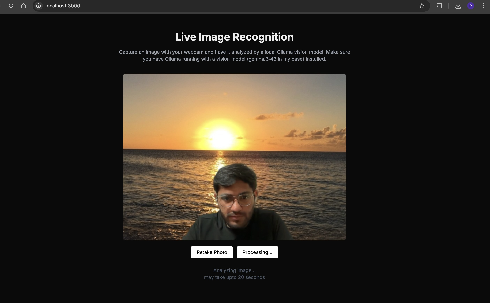
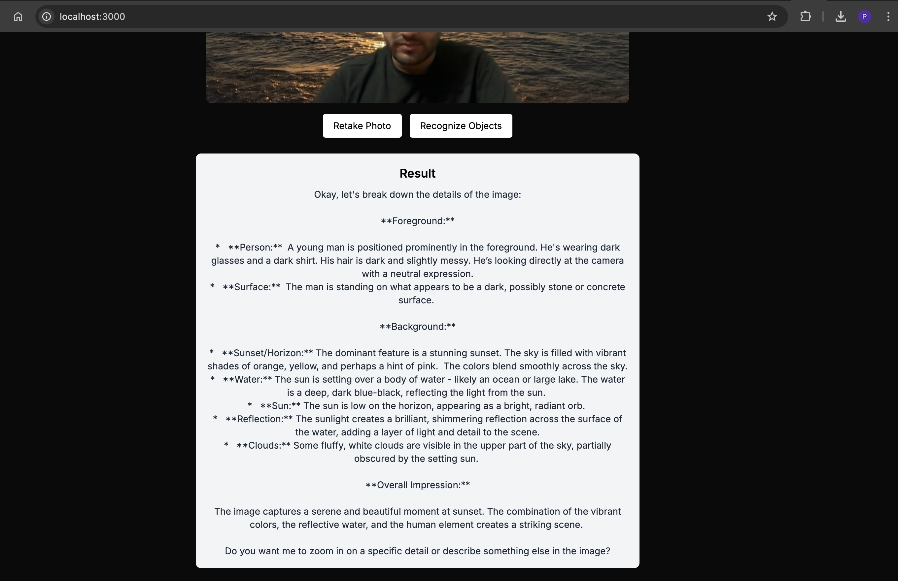

This is a full-stack Next.js application that uses your webcam to capture images and analyze them using a local Ollama vision model.

##Preview



## Prerequisites

- [Node.js](https://nodejs.org/) (v18 or later)
- [Ollama](https://ollama.ai/) installed and running locally
- A vision-capable model pulled in Ollama (e.g., llava:latest, llama3-vision, moondream)

## Setup Ollama

1. Install Ollama by following the instructions at [https://ollama.ai/](https://ollama.ai/)
2. Pull a vision-capable model:
   ```bash
   ollama pull <the vision model you prefer>
   
   gemma3 [4b-27b] or llama3.2 or llava:latest
   ```
3. Make sure Ollama is running on your machine (it should run on http://localhost:11434)

## Getting Started

1. Install dependencies:
   ```bash
   npm install
   ```

2. Start the development server:
   ```bash
   npm run dev
   ```

## How to Use

1. Allow camera access when prompted by your browser
2. Click the "Capture Photo" button to take a photo
3. Click "Recognize Objects" to send the image to Ollama for analysis

## Configuration

- The default model is set to `gemma3:4b`. You can change this in `lib/ollamaApi.ts`
- The API endpoint for Ollama is set to `http://localhost:11434/api/generate`. Adjust this if your Ollama instance is running elsewhere


## Technologies Used

- Next.js with TypeScript
- React Webcam for camera access
- Axios for API calls
- Tailwind CSS for styling
- Ollama for local AI vision model inference
